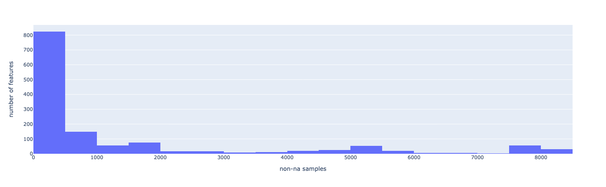
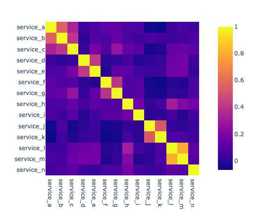

# Название

- [Название](#название)
  - [Постановка задачи](#постановка-задачи)
  - [Финальное решение](#финальное-решение)
    - [Решение влоб — сatboost на всех фичах без предобработки](#решение-влоб--сatboost-на-всех-фичах-без-предобработки)
      - [Метрики на валидации](#метрики-на-валидации)
    - [Решение сложное](#решение-сложное)
      - [Модель](#модель)
      - [Метрики на валидации](#метрики-на-валидации-1)
  - [Как я пришел к этому](#как-я-пришел-к-этому)
    - [Данные](#данные)
  - [Эксперименты](#эксперименты)
    - [Baseline](#baseline)
    - [Catboost](#catboost)
    - [Feature is NaN](#feature-is-nan)
    - [Oversample + Undersample](#oversample--undersample)
    - [Устойчивость к NaN в test](#устойчивость-к-nan-в-test)
  - [Что хотел сделать, но не успел](#что-хотел-сделать-но-не-успел)


## Постановка задачи
* В файле `problem_train.csv` в каждой строке содержится информация об объекте
с уникальным идентификатором, заданным в столбце `id`.

* В файле `problem_labels.csv` для каждого `id` из файла `problem_train.csv` приведена информация о
принадлежности к 14 категориям.

* В файле `problem_test.csv` дана информация об объектах, аналогичная содержащейся в файле
`problem_train.csv`.

* Используя `problem_train.csv` и `problem_labels.csv` в качестве данных для обучения, постройте файл
`problem_test_labels.csv`, в котором для каждого объекта из файла `problem_test.csv` укажите
вероятность его принадлежности к каждой из 14 рассматриваемых категорий.

* Для оценки качества полученного результата будет использоваться метрика `LogLoss`. По каждой из 14 
категорий метрика считается независимо, затем берется среднее арифметическое значений метрик,
полученных для категорий.

* Пожалуйста, предоставьте краткое описание пути поиска решения и код, использованный для получения
результата.


## Финальное решение

### Решение влоб — сatboost на всех фичах без предобработки

#### Метрики на валидации

| label     | score |
| --------- | ----- |
| mean      | 0.26  |
| service_a | 0.37  |
| service_b | 0.49  |
| service_c | 0.51  |
| service_d | 0.03  |
| service_e | 0.15  |
| service_f | 0.06  |
| service_g | 0.20  |
| service_h | 0.43  |
| service_i | 0.04  |
| service_j | 0.36  |
| service_k | 0.45  |
| service_l | 0.11  |
| service_m | 0.10  |
| service_n | 0.33  |


### Решение сложное

#### Модель
`OneHotEncoder(categorical) → Impute(mean, numerical) + Impute(most_frequent, categorical) → LogisticRegression(default params)`

Препроцессинг: [preprocess.py](./src/preprocess.py). Обучение: [train.py](./src/train.py)


#### Метрики на валидации

| label     | score |
| --------- | ----- |
| mean      | 0.28  |
| service_a | 0.37  |
| service_b | 0.49  |
| service_c | 0.51  |
| service_d | 0.03  |
| service_e | 0.18  |
| service_f | 0.05  |
| service_g | 0.16  |
| service_h | 0.47  |
| service_i | 0.06  |
| service_j | 0.35  |
| service_k | 0.45  |
| service_l | 0.22  |
| service_m | 0.19  |
| service_n | 0.33  |


## Как я пришел к этому
### Данные
Поступившие данные были достаточно загадочны. Подробно я их анализирую в [ноутбуке EDA](./notebooks/001%20-%20eda.ipynb).

У нас есть 8000 семплов и 1379 колонок.
Из них 1000 категориальных, как минимум 9 ordinal (1 2 3 ...) и 345 float.

```python
>>> train_df.dtypes.value_counts()

object     1025
float64     345
int64         9
```

Названия колонок зашифрованы — `c_1375`, `n_0005`, `o_0233`. Есть одна названная `release`.
Вместе с названиями лейблов `service_4` это наводит меня на мысль о том, что домен -
это набор сервисов в инфраструктуре, и эти сервисы могут релизиться.
Возможно, мы определяем, какие сервисы в данный момент сбоят исходя из каких-то продовых метрик.

```python
>>> train_df.columns.to_series().apply(lambda name: name[:2]).value_counts()

c_    1050
o_     211
n_     116
id       1
re       1
```

При этом данные по большей части состоят из NaN-ов.
768 (больше половины) колонок состоят на 95 % из NaN-ов.

```python
>>> len(desc.loc["count"][desc.loc["count"] < 400])

768
```

Есть фичи, полностью NaN на трейне.
```python
>>> len(desc.loc["count"][desc.loc["count"] == 0].index)

30
```

Также есть фичи, которые принимают на всей трейн выборке одно значение — 1.
```python
>>> len(desc.loc["count"][desc.loc["unique"] == 1].index)

102
```

Когда я обнаружил такую разреженность в данных, решил строить бейзлан на хорошо определенных фичах.
В качестве критерия взял, что фича должна быть определена на >= 7000/8000 семплов.
Можно было взять и поменьше, но я не был уверен,
как повлияет бо́льшее количество imputed данных на предсказания.



```python
>>> train_counts = train_df.describe(include="all").loc["count"]
>>> len(train_counts[train_counts > 7000])

90
```

Среди этих фичей я обнаружил 6 фичей, у которых было одно уникальное значение,
т.е. они не несут никакой полезной нагрузки.
```python
>>> train_df[["n_0047", "n_0050", "n_0052", "n_0061", "n_0075", "n_0091"]].apply(pd.value_counts)

	n_0047	n_0050	n_0052	n_0061	n_0075	n_0091
1	8000	8000	8000	8000	8000	8000
```

Некоторые `n_` колонки, хотя и `float`, на самом деле обладают дискретными значениями
(например, `0.1875` в `n_0109`).
Возможно, имело смысл перевести их в `ordinal`.
```python
>>> train_df[["n_0005", "n_0038", "n_0067", "n_0078", "n_0083", "n_0108", "n_0109"]]

	    n_0005	n_0038	n_0067	n_0078	n_0083	n_0108	n_0109
0   	0.3684 	0.1935	0.9286	0.8000	1.0000	0.8000	0.1875
1   	0.3158 	0.1774	0.9286	0.6667	0.0000	0.6667	0.1875
2   	0.3421 	0.2903	0.4286	0.8333	1.0000	0.8333	0.1875
3   	0.4474 	0.3710	0.5714	0.5667	0.8333	0.5667	0.1875
4   	0.3158 	0.1774	0.9286	0.6000	0.6667	0.6000	0.2500
...	  ... 	  ...   	...   	...   	...   	...   	...
7995	0.3947	0.2097	0.0000	0.1667	0.0000	0.1667	0.0625
7996	0.3947	0.2903	0.7143	0.7333	0.0833	0.7333	0.1250
7997	0.3947	0.1774	1.0000	0.8333	1.0000	0.8333	0.0625
7998	0.2895	0.1774	0.3571	0.4000	1.0000	0.4000	0.1250
7999	0.6316	0.5161	0.4286	0.7000	1.0000	0.7000	0.0625
```


Я попробовал разложить те 90 фичей по PCA, раскладывались хорошо.
Я сделал 5 компонент, первые 3 покрывали 95% дисперсии.

Думаю, стоило применить PCA на весь датасет и построить модель на этом. 


---

У многих лейблов, как мы любим, сильный дисбаланс классов: `d, e, f, g, i, j, l, m`

```python
>>> train_labels_df.apply(lambda x: pd.value_counts(x, normalize=True)).round(2).T

            0	    1
service_a	0.53	0.47
service_b	0.67	0.33
service_c	0.74	0.26
service_d	0.98	0.02
service_e	0.95	0.05
service_f	0.97	0.03
service_g	0.95	0.05
service_h	0.70	0.30
service_i	0.98	0.02
service_j	0.15	0.85
service_k	0.22	0.78
service_l	0.89	0.11
service_m	0.91	0.09
service_n	0.82	0.18
```

Я заметил, что некоторые лейблы сильно скоррелированы друг с другом
(например, `pearson(i-m)` = 0.8), но дальше этот вопрос не исследовал.



---
У тестовых данных фичи те же самые, что и у трейновых.
```python
>>> len(train_df.columns.intersection(test_df.columns))

1379
```

В тесте также присутствовали полностью NaN колонки.
```python
>>> len(test_desc.loc["count"][test_desc.loc["count"] == 0].index)

179
```
Я решил не удалять их из трейн данных,
потому что в разное время на проде у нас разные колонки могут NaN-иться,
так что модель должна быть устойчива к такому поведению.
Я немного [поисследовал](#устойчивость-к-NaN-в-test) это свойство моей модели.

---

## Эксперименты

Мне сказали, что фокус этого задания на работе с данными, поэтому в экспериментах я не особо
заморачивался с подбором гиперпараметров и выбором лучшей модели,
а скорее пытался понять, какие фичи полезные.

### [Baseline](./notebooks/002%20-%20base%20model.ipynb)
Для обучения я взял те 90 хорошо определенных фичей. Препроцессинг — для категориальных
OneHotEncoder, заменяя NaN-ы на вектор `[0, 0, ... 0]`. Для числовых — среднее по выборке.
В эксперименте я применял one-hot и impute ко всей выборке сразу, потому что так было быстрее.
В коде и следующих экспериментах я использую полноценный `sklearn.Pipeline` для правильной обработки.

В качестве моделей я выбрал LogReg и RandomForest. При обучении я изначально смотрел на ROC-AUC
потому что его понятнее как интерпретировать на уровне "модель говно" vs "модель может быть хорошей",
чем LogLoss. 

Так как у нас дисбаланс классов, я решил еще смотреть на `classification report`
(`precision`, `recall`, `f1`). Мой RandomForest выдавал f1 = 0 на большом количестве классов,
то есть вообще не выдавал в ответах лейбл `1`.
Я решил его откалибровать с помощью `sklearn.calibraion.CalibratedClassifierCV`,
это немного улучшило ROC-AUC и f1 macro, а также почти полностью убрало нулевые f1 по таргетам.
LogReg такой проблемой почти не страдал, хотя для лейбла `service_i` 
он также не предсказывал ни одной единички.

LogReg выдавал такие же результаты, как и калиброванный RandomForest — LogLoss = 0.30.
Калибровка RandomForest ощутимо изменяла LogLoss (0.30 vs 0.32).

Для проверки на дурака я также построил DummyClassifier, который в качестве ответа выдавал
априорную вероятность класса 1, не учитывая фичи — он выдал LogLoss 0.38, ощутимо хуже.

Решил дальше использовать логрег, потому что он проще и его не нужно калибровать.


### [Catboost](./notebooks/003%20-%20catboost%20go%20brrr.ipynb)
Конечно, я попробовал также сходить по пути наименьшего сопротивления и засунуть все как есть в катбуст. 

Из препроцессинга я удалил колонки, полностью NaN-овые, а в категориальных фичах заменил NaN-ы
на строку "nan", потому что катбуст не любит NaN-ы в категориальных фичах.

Сначала я обучал одну модель на все таргеты, используявстроенный
[`MultiLogLoss`](https://catboost.ai/en/docs/concepts/loss-functions-multilabel-classification#MultiLogloss),
который предназначен для multi-label обучения.
Обучалась модель хорошо (правда долго), но когда я пытался использовать ее скоры,
чтобы посчитать метрики самостоятельно, метрики выходили ужасные (`log_loss` = 6.9, `roc_auc` = 0.65).
Я не смог понять, почему так произошло, и решил учить по одной модели на каждый таргет,
тем более обучилось оно не хуже, и метрики выдавало такие же (и обучалось намного быстрее).

Итоговая метрика получилась сильнее — LogLoss 0.26 (vs 0.28 от финального LogReg). 


### [Feature is NaN](./notebooks/004%20-%20check%20correlation%20between%20not-na%20and%20all-0%20labels.ipynb)
У меня возникла гипотеза, что может быть какая-то корреляция между тем,
когда какая-то малопредставленная фича присутствует (не NaN) и лейблами с сильным дисбалансом.

Я добавил в датасет колонки `{feature}_isna`, обучил LogReg — качество сильно ухудшилось.

Попробовал посмотреть корреляцию между колонками `{feature}_isna` и лейблами.
Обнаружил одну колонку `c_0572`, которая сильно коррелировала с `service_a` (0.57) и `service_b` (0.36).
Попробовал обучить модели чисто на эти лейбли с одной этой фичей, ничего не получилось.

В целом, кажется, эти фичи могут быть полезными, но нужно побольше поисследовать.

### [Oversample + Undersample](./notebooks/005%20-%20dealing%20with%20imbalance.ipynb)
Решил попробовать бороться с дисбалансом классов с помощью семплинга.
Использовал как oversample минорного класса, так и оверсемплинг мажорного, так и их комбинацию.
Использовал библиотеку `imbalanced-learn`.

Перебирал разные параметры семплинга, обучать только на одном лейбле — 
ничего не сработало, модель только ухудшалась.

Также попробовал передавать при обучении параметр `class_weight` — это тоже не дало буста.


### Устойчивость к NaN в test
В [ноутбуке 6](./notebooks/006%20-%20try%20to%20use%20more%20columns.ipynb) я попробовал исследовать,
как модель будет себя вести, если какие-то из используемых ею колонок внезапно станут nan-ами
(например, сдохнет сервис, которых посылают данную фичу).
Дизайн: обучаем на всех фичах, в валидации маскируем 10% случайно выбранных фичей.
Результат: большинство маскировок незначительно влияло на средний logloss (0 - 0.1).
Возможно, это потому что либо большинство фичей бесполезных,
При этом я заметил, что маскировка фичи `c_1259` стабильно занижает скор,
либо потому что моя модель делает decision только лишь по некоторым из них.
Особенно на `service_a` (+ 1.4), а также на других: 
(`service_b` + 0.26, `service_h` + 0.10, `service_{c,d}` + 0.04).

Я посмотрел на корреляцию между `service_a` и 84 используемыми фичами,
фича `c_1259` далеко не самая высоко коррелирующая. Почему ее NaN-изация так влияет, не знаю.

## Что хотел сделать, но не успел
* Взять менее определенные фичи, например те, которые определены на >=50% семплов.
* Попробовать более сложные методы заполнения NaN-ов.
Например, IterativeImputer, библиотеку `datawig`.
* Строить модель на основе фичей PCA.